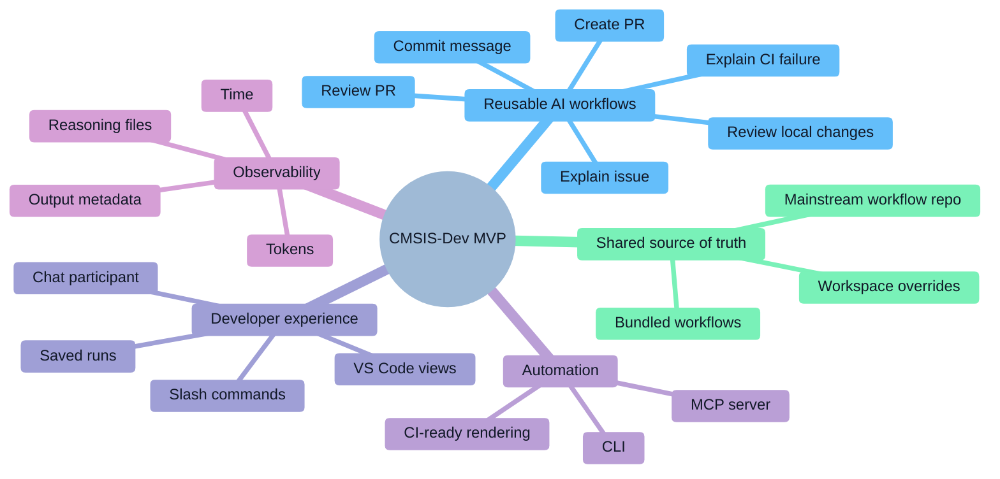
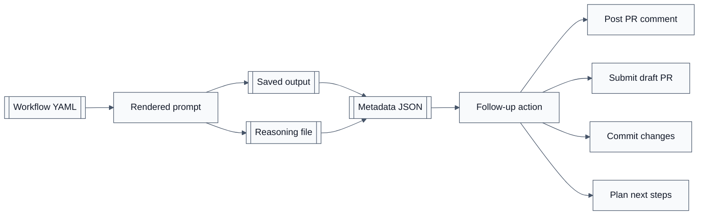
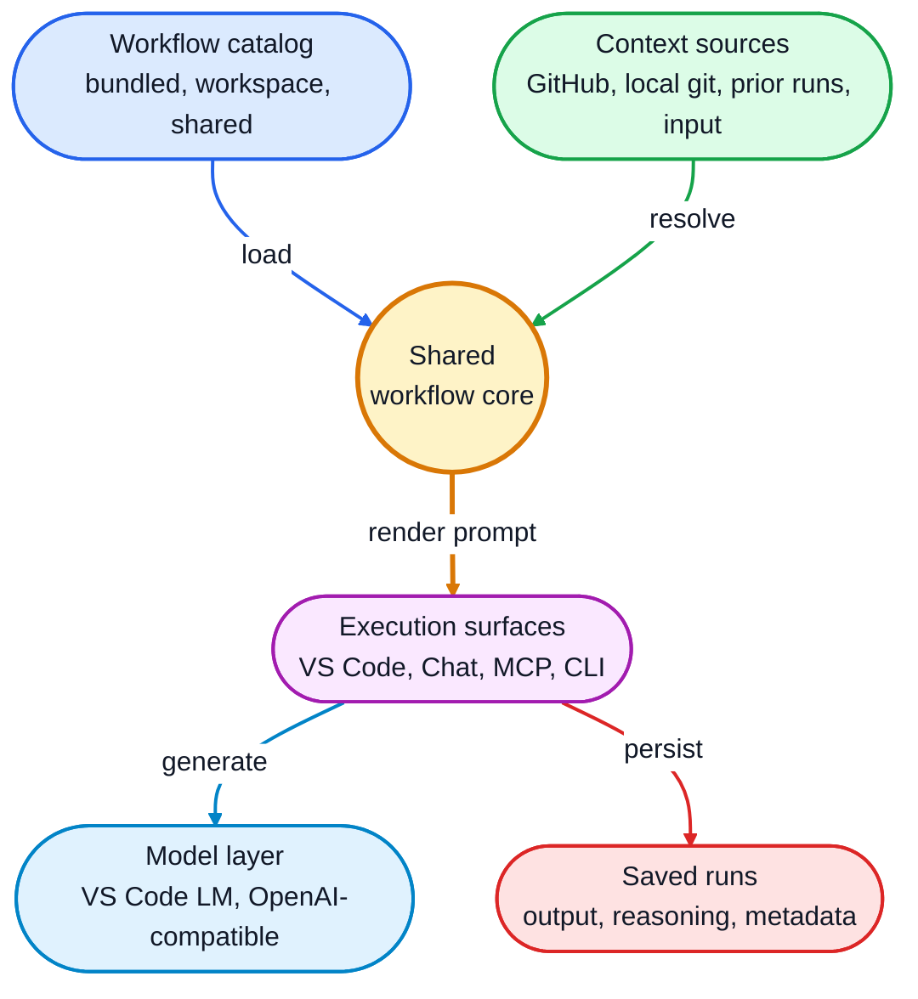
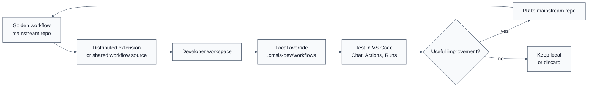
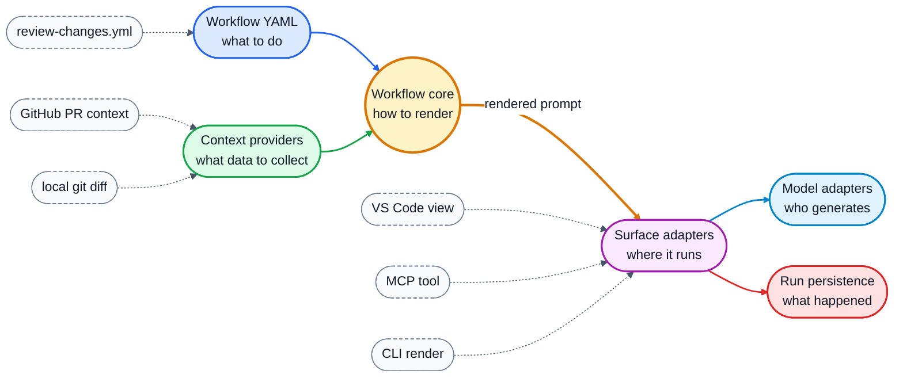

# CMSIS-Dev MVP Presentation

## Executive Summary

CMSIS-Dev is an MVP for sharing, distributing, and running reusable AI workflows across development environments.

The product starts from a practical problem: teams are already using AI to review pull requests, explain issues, write commit messages, investigate CI failures, and plan follow-up work, but those workflows often live as private prompts, chat history, or one-off scripts. CMSIS-Dev turns those workflows into versioned assets that can be reused from VS Code, exposed to AI agents through MCP, and rendered from the CLI for automation and CI.

The MVP is intentionally focused on our own GitHub-based development flow: repositories are hosted on GitHub, day-to-day development happens in VS Code, and workflow outputs should be easy to inspect, reuse, and improve. The architecture is broader than the initial workflow set: workflows are data, execution surfaces are adapters, and context providers are isolated from prompt rendering.

## Product Scope

The main scope of CMSIS-Dev is reusable AI workflows.

In the MVP, those workflows support common development tasks:

- Review local changes before opening a pull request.
- Review an existing GitHub pull request.
- Draft a pull request title and body.
- Generate a commit message from local changes.
- Explain a GitHub issue.
- Explain a failing GitHub Actions workflow run.
- Continue from a previous CMSIS-Dev run output.

The important product idea is not only the current list of workflows. The important idea is that a team can treat AI workflows as shared engineering assets, with the same expectations we have for scripts, test fixtures, documentation, and CI configuration.

## MVP Goals

CMSIS-Dev is designed around five MVP goals:

1. Share workflows through source control.
2. Run the same workflow from VS Code, Chat, MCP, CLI, and future CI integrations.
3. Keep workflows easy to override locally for temporary experiments.
4. Preserve a clear path for promoting improvements back to the mainstream repository.
5. Capture run metadata so workflow quality, cost, and performance can be measured.

## Architecture Principles

CMSIS-Dev separates workflow intent from execution mechanics.

- Workflows are declarative YAML files.
- Context providers collect external data from GitHub, local git repositories, previous runs, or user input.
- The renderer turns workflow templates plus resolved context into prompts.
- Execution surfaces decide how the workflow is launched: VS Code action, Chat participant, MCP tool, or CLI command.
- Model providers decide which language model is used.
- Run persistence records output, reasoning, metadata, timing, and token usage.

This separation keeps the MVP extensible. A new workflow usually means adding or editing YAML. A new context source usually means adding one provider. A new execution surface can reuse the same registry, context resolution, and prompt rendering layers.

## Product Artifact Map

The artifacts are intentionally plain files where possible. That makes runs inspectable, shareable, and useful for future evaluation without requiring a database in the MVP.

## High-Level Architecture

## Workflow Distribution Model

CMSIS-Dev supports a practical workflow lifecycle:

1. A golden workflow is distributed with the extension or shared through the mainstream repository.
2. A developer can create a local workspace override under `.cmsis-dev/workflows/`.
3. The override replaces the workflow with the same `id` for that workspace only.
4. The developer can test and improve the workflow during normal development.
5. Useful improvements can be committed back to the mainstream repository.
6. The next distributed version makes the improved workflow available to everyone.

This model makes local experimentation cheap without fragmenting the team. Temporary changes stay local. Valuable changes become reviewed, versioned assets.

## Key Architecture Elements

### Workflow Definitions

Workflow definitions are the product's core asset.

They describe:

- Workflow identity, title, and description.
- Inputs required by the workflow.
- Context providers needed to resolve those inputs.
- Prompt template used to produce the final AI request.
- Follow-up actions supported by the generated output.

Because workflows are data, they can be shared, reviewed, versioned, diffed, and tested like any other engineering artifact.

### Shared Workflow Core

The shared core owns the logic that must remain consistent across all execution surfaces:

- Load installed workflows and workspace overrides.
- Merge workflows by `id`.
- Resolve supported context inputs.
- Project context into template placeholders.
- Render prompts from workflow templates.
- Normalize metadata and follow-up state.

This is the architectural center of the MVP. It prevents the VS Code extension, MCP server, and CLI from becoming separate implementations of the same workflow behavior.

### VS Code Extension

The VS Code extension is the main developer experience.

It provides:

- An Actions view for launching workflows quickly.
- A Workflows view for inspecting effective workflow files.
- A Runs view for browsing saved outputs.
- Commands for review, commit message generation, PR creation, token management, and workflow refresh.
- Integration with VS Code SecretStorage for tokens.
- Integration with the VS Code Chat UI and selected language model.
- Follow-up actions such as opening reasoning, posting a PR comment, opening an issue, submitting a PR, or committing changes.

The extension is deliberately an adapter over the workflow core. It owns UI, interaction, and persistence, but workflow behavior comes from the shared workflow definitions and core modules.

### Chat Participant and Slash Commands

CMSIS-Dev contributes a Chat participant, `@cmsisdev`.

The participant gives developers a natural Chat entry point:

- `@cmsisdev /run` opens a workflow picker.
- `@cmsisdev /review-changes` reviews local changes.
- `@cmsisdev /review-pr` reviews a GitHub PR.
- `@cmsisdev /create-pr` drafts pull request text.
- `@cmsisdev /commit-message` generates a commit message.
- `@cmsisdev /explain-issue` explains a GitHub issue.
- `@cmsisdev /explain-ci-failure` investigates a CI failure.

The purpose of the participant is routing. It turns Chat commands into structured workflow runs, while still allowing normal Chat to handle freeform prompts when appropriate.

### Language Model Provider

CMSIS-Dev can provide models through an OpenAI-compatible API using an OpenAI API key.

The provider can discover available models from the configured API endpoint and expose them through VS Code's model picker. This gives the team control over which models are available, while keeping model selection inside the normal VS Code Chat experience.

The design keeps model transport separate from workflow definitions. A workflow does not need to know whether the model is provided by VS Code, a hosted OpenAI-compatible service, or another future provider.

### MCP Server

The bundled MCP server exposes compatible workflows as MCP tools.

Its purpose is interoperability with AI agents and clients that understand Model Context Protocol. Instead of copying workflow prompts into each AI client, the MCP server lets those clients discover and invoke the same workflow catalog.

The MCP server focuses on prompt materialization:

- Load the workflow catalog.
- Register one tool per compatible workflow.
- Resolve supported context inputs.
- Return the rendered prompt as tool output.

It does not need to own the VS Code UI, run persistence, or follow-up actions. Those remain extension responsibilities.

### CLI

The CLI provides a non-interactive path for automation.

It can render a workflow prompt from explicit arguments, environment variables, and supported context flags. This is important for CI because CI jobs should not depend on VS Code UI interactions.

Example use cases:

- Render a PR review prompt during CI.
- Render a CI failure explanation prompt from a GitHub Actions run id.
- Validate that workflow templates can be loaded and rendered.
- Compare output quality across workflow versions in scripted experiments.

The CLI is a step toward a single source of truth: the same workflow definitions can serve interactive development, agent integration, and automation.

## Separation of Concerns

This structure gives the MVP a clean growth path:

- Add a workflow without changing UI code.
- Add a context provider without changing the renderer.
- Add another execution surface without duplicating workflow logic.
- Add another model provider without rewriting workflow definitions.

## Why This Approach

CMSIS-Dev chooses a workflow-centric architecture instead of a chat-history-centric architecture.

That matters because teams need repeatability. A useful workflow should not depend on remembering which prompt someone typed last week. It should be a versioned artifact with explicit inputs, known context sources, and measurable outputs.

### Advantages

- Reuse: the same workflow can run from VS Code, Chat, MCP, CLI, and future CI jobs.
- Governance: golden workflows can be reviewed and committed to the mainstream repository.
- Experimentation: local overrides allow temporary improvements without breaking shared behavior.
- Consistency: context gathering and prompt rendering are shared across surfaces.
- Developer fit: VS Code integration keeps workflows close to code, git, debugging, testing, and review.
- Automation fit: CLI and MCP support non-UI scenarios and future pipeline usage.
- Observability: run metadata creates a foundation for measuring cost, latency, and quality.

## Comparison With Alternatives

| Alternative | Description | Strengths | Limitations compared with CMSIS-Dev |
| --- | --- | --- | --- |
| Plain prompt documents | Store prompts in markdown or wiki pages and copy them into Chat. | Simple, low tooling cost. | Manual context gathering, weak repeatability, no run metadata, no automation path. |
| Ad hoc scripts | Write scripts for each task, such as PR review or issue explanation. | Can be automated and customized deeply. | Workflow logic fragments across scripts; hard to expose naturally in VS Code Chat; less discoverable for developers. |
| CI-only AI jobs | Run AI workflows only in GitHub Actions or another CI system. | Good repeatability and centralized control. | Slow feedback loop; not integrated with local development; harder to iterate on workflows. |
| VS Code commands only | Build each AI action as custom extension code. | Strong editor integration. | Each workflow requires code changes; less reusable outside VS Code; harder to distribute as team-editable assets. |
| MCP-only tools | Expose AI workflows only as MCP tools. | Good agent interoperability. | Does not provide a first-class VS Code developer experience by itself; less visible to developers. |
| CMSIS-Dev workflow architecture | Declarative workflows with VS Code, Chat, MCP, and CLI adapters. | Shared source of truth, local overrides, editor integration, automation path, measurable runs. | Requires maintaining workflow schema, context providers, and distribution rules. |

The alternatives are valid in specific contexts. CMSIS-Dev combines their strongest properties: editor-native development, source-controlled workflow assets, agent interoperability, and automation readiness.

## Initial MVP Use Cases

### Review Local Changes

The workflow collects local git changes, compares them against the default branch, includes relevant diffs and repository metadata, and asks the model for a review. This is useful before creating a PR.

### Review Pull Request

The workflow fetches PR metadata and changed files from GitHub, renders a review prompt, saves the output, and can support follow-up actions such as posting a review comment.

### Create Pull Request

The workflow uses local changes, PR templates, and prior review output to draft a PR title and body. This turns review insight into a structured contribution artifact.

### Explain Issue

The workflow fetches issue metadata, comments, and linked references to help a developer understand the problem, likely affected areas, and possible next steps.

### Explain CI Failure

The workflow collects GitHub Actions run context, failing jobs, and log excerpts to produce a focused diagnosis.

## Metrics and Observability

CMSIS-Dev already stores run metadata such as:

- `startedAt`
- `completedAt`
- `elapsedMs`
- `generationMs`
- `promptTokens`
- `outputTokens`
- `totalTokens`
- `promptCharacters`
- `outputCharacters`
- workflow id, model name, engine, output path, and reasoning path

These fields are enough to start measuring the MVP without adding a large analytics system.

Recommended MVP metrics:

| Metric | Why it matters |
| --- | --- |
| Runs per workflow | Shows which workflows are actually useful. |
| Median and p95 elapsed time | Shows developer experience and latency impact. |
| Median and p95 generation time | Separates model latency from input collection and file work. |
| Tokens per workflow | Estimates cost and identifies prompts that are too large. |
| Output size | Helps detect overly verbose or empty outputs. |
| Cancellation rate | Indicates confusing input flows or slow workflows. |
| Follow-up usage rate | Shows whether outputs lead to useful actions such as PR creation or comments. |
| Override frequency | Shows where teams are actively improving workflows. |
| Promotion rate | Measures how often local improvements become golden workflows. |
| Re-run rate after workflow changes | Helps evaluate whether prompt improvements change behavior. |

Future metrics can combine metadata with developer feedback:

- Thumbs up or thumbs down per run.
- Manual rating of usefulness.
- Whether a generated PR body was edited before submission.
- Whether an AI review comment was posted, discarded, or rewritten.
- Whether CI explanations reduced time to fix.
- Whether review workflows catch issues before human review.

## Improvement Ideas

### Workflow Sharing and Governance

- Add first-class loading from a shared GitHub workflow repository.
- Define workflow channels such as stable, experimental, and local.
- Add signed or pinned workflow versions for reproducibility.
- Add PR checks that validate workflow YAML, render sample prompts, and detect missing placeholders.
- Add workflow changelogs and ownership metadata.

### Workflow Authoring

- Provide a workflow authoring wizard.
- Add preview rendering inside VS Code.
- Add sample input fixtures for each workflow.
- Add tests that compare rendered prompts against expected snapshots.
- Add schema-driven completion and hover help for workflow YAML.

### CI and Automation

- Add documented CI recipes for rendering workflows in GitHub Actions.
- Add a mode that runs a workflow and posts output as a PR comment.
- Add baseline comparisons for workflow output across model versions.
- Add batch execution for evaluating multiple workflows against test fixtures.

### Model and Provider Support

- Support multiple OpenAI-compatible endpoints.
- Store model capability metadata such as context window, output limit, and tool support.
- Add policy controls for which workflows can use which models.
- Add cost estimates before running large prompts.

### Output Quality and Feedback

- Add explicit feedback buttons on saved runs.
- Track edited versus accepted generated text.
- Connect workflow improvements to before-and-after metrics.
- Add quality dashboards for workflow maintainers.

### Security and Trust

- Make secret handling explicit for GitHub and model API keys.
- Add trust prompts for workspace-provided workflow overrides.
- Add allowlists for context providers that can access local files or repository data.
- Redact sensitive values from saved reasoning and metadata where needed.

## MVP Message

CMSIS-Dev is not only a VS Code extension with a few AI commands. It is an architecture for turning repeated AI-assisted development practices into shared, versioned, measurable workflows.

The MVP proves the core idea in a realistic environment: GitHub repositories, VS Code development, local git changes, pull requests, issues, CI failures, model selection, saved outputs, and automation-ready prompt rendering.

The next step is to grow the workflow catalog and distribution model while preserving the separation of concerns that makes the current MVP extensible.